# Zentestic

  

Zentestic is a Test Case Management System that helps QA teams efficiently plan, execute, and track testing cycles. It centralizes test cases, improves collaboration, and provides clear visibility into testing progress to ensure high-quality software delivery.

## What You Can Do

- **Organize test cases** across projects and products in one place
- **Plan test cycles** with flexible allocation strategies — round robin or random assignment
- **Track test runs** from draft through completion, with statuses like Pass, Fail, Blocked, and Retest
- **Carry forward failures** automatically — blocked and failed cases roll into retest runs
- **Collaborate across roles** — QA leads, testers, and stakeholders each have a clear view of progress
- **Monitor quality trends** with built-in charts and progress snapshots

## Screenshots

### Dashboard

  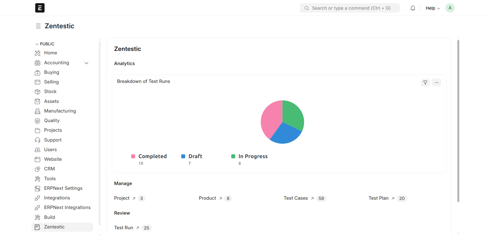

<strong>Workspace dashboard</strong> Test-run breakdown chart and shortcuts to projects, products, cases, plans, and runs

### Products

<table>
  <tr>
    <td align="center" valign="top" width="50%">
      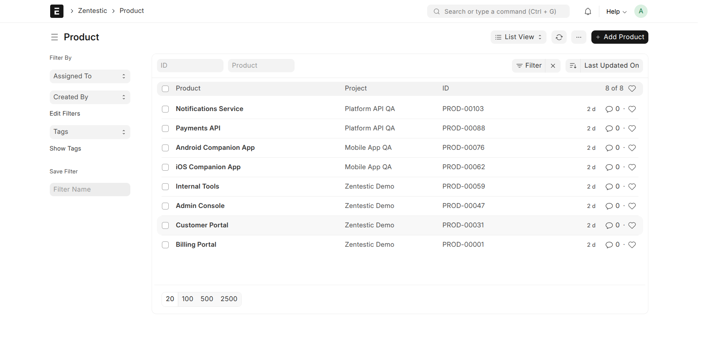
      
<strong>Products</strong> Track products under each project

    </td>
    <td align="center" valign="top" width="50%">
      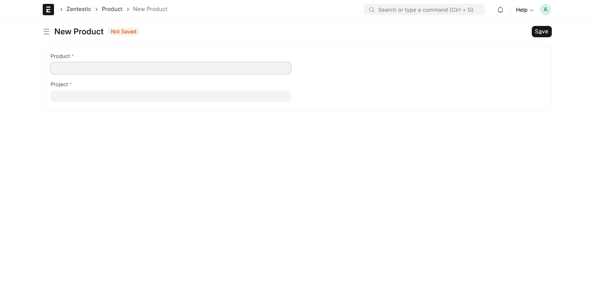
      
<strong>New product</strong> Link a product to its project

    </td>
  </tr>
  <tr>
    <td align="center" valign="top" width="50%">
      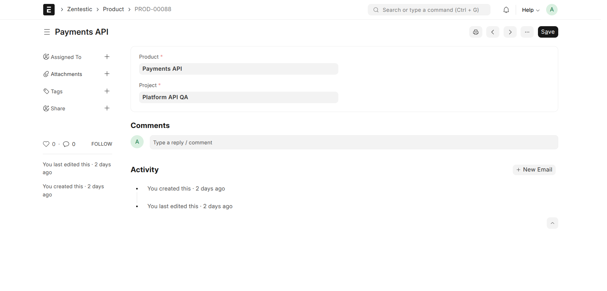
      
<strong>Product details</strong> Activity, comments, and metadata for a product

    </td>
    <td align="center" valign="top" width="50%"></td>
  </tr>
</table>

### Projects

<table>
  <tr>
    <td align="center" valign="top" width="50%">
      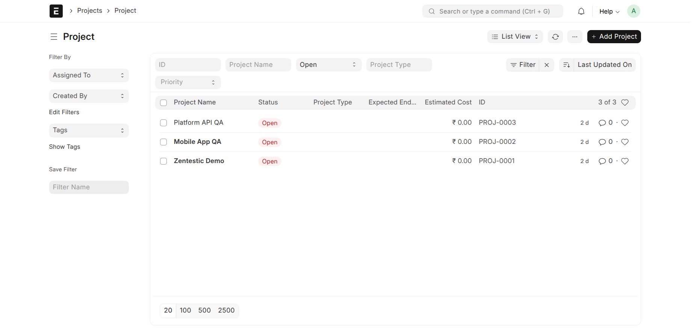
      
<strong>Projects</strong> Organize QA work across projects

    </td>
    <td align="center" valign="top" width="50%">
      
      
<strong>New project</strong> Name, status, priority, and dates for a QA project

    </td>
  </tr>
  <tr>
    <td align="center" valign="top" width="50%">
      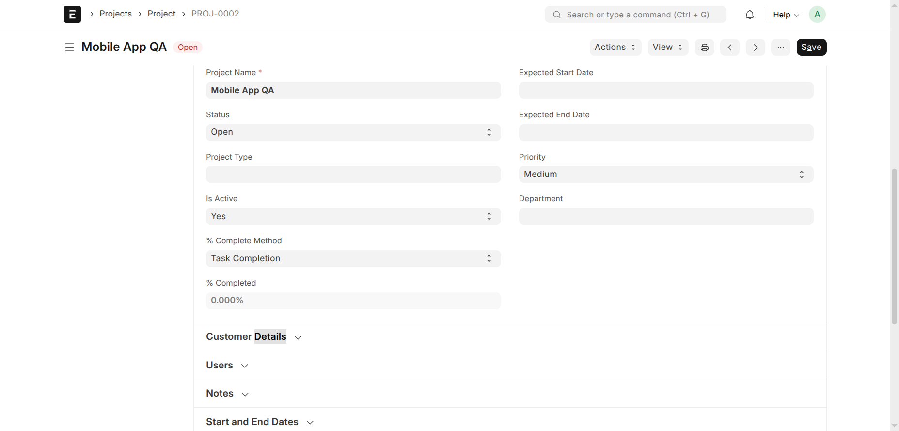
      
<strong>Project details</strong> Status, completion, and project metadata

    </td>
    <td align="center" valign="top" width="50%"></td>
  </tr>
</table>

### Test cases

<table>
  <tr>
    <td align="center" valign="top" width="50%">
      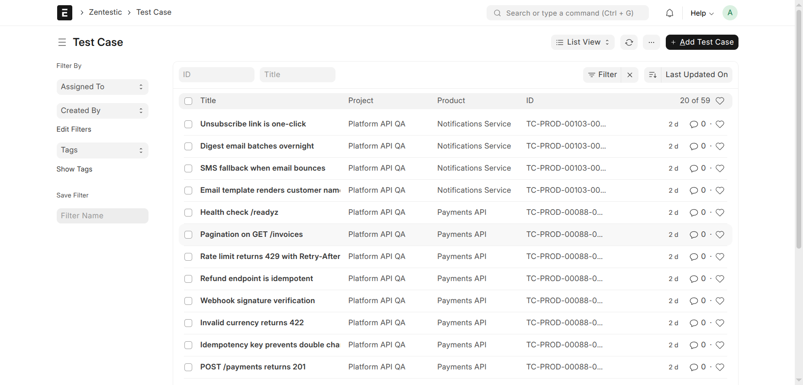
      
<strong>Test case list</strong> Browse cases by project and product

    </td>
    <td align="center" valign="top" width="50%">
      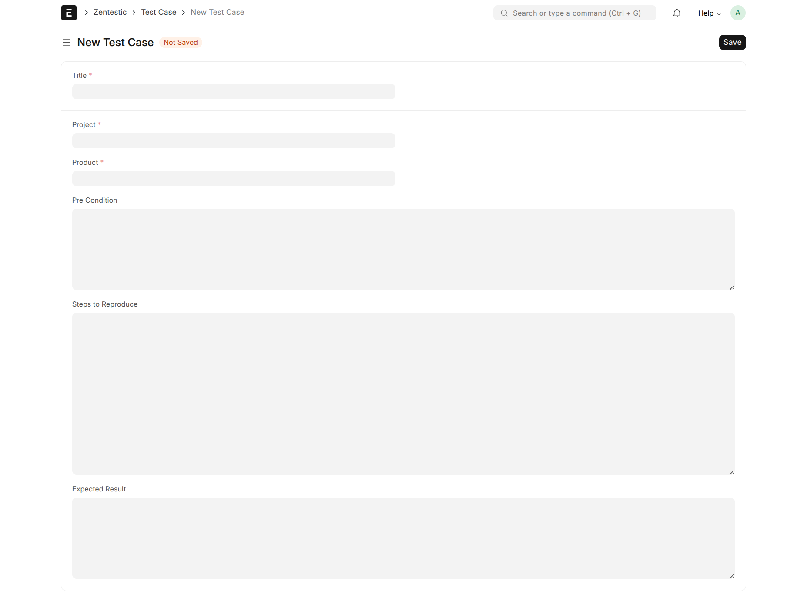
      
<strong>New test case</strong> Capture title, preconditions, steps, and expected result

    </td>
  </tr>
  <tr>
    <td align="center" valign="top" width="50%">
      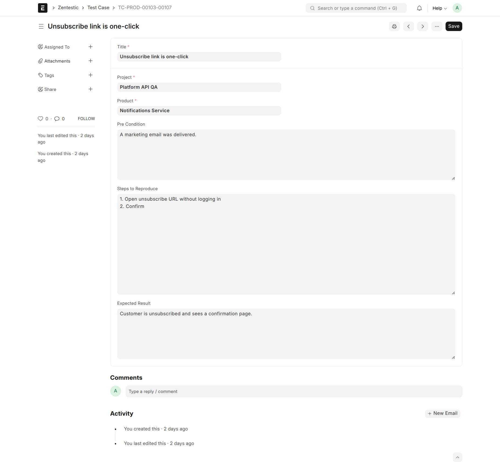
      
<strong>Test case details</strong> Full documentation for a single case

    </td>
    <td align="center" valign="top" width="50%"></td>
  </tr>
</table>

### Test plans

<table>
  <tr>
    <td align="center" valign="top" width="50%">
      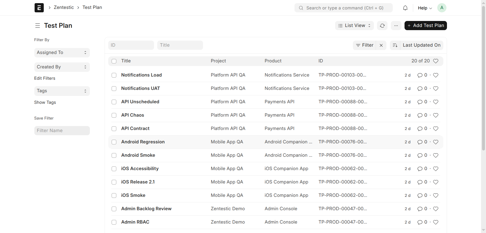
      
<strong>Test plan list</strong> Plans grouped by project and product

    </td>
    <td align="center" valign="top" width="50%">
      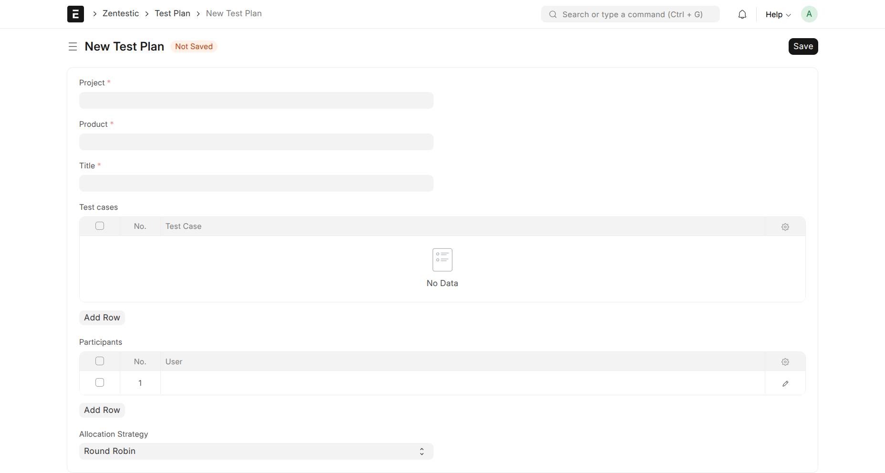
      
<strong>New test plan</strong> Add cases, participants, and an allocation strategy

    </td>
  </tr>
  <tr>
    <td align="center" valign="top" width="50%">
      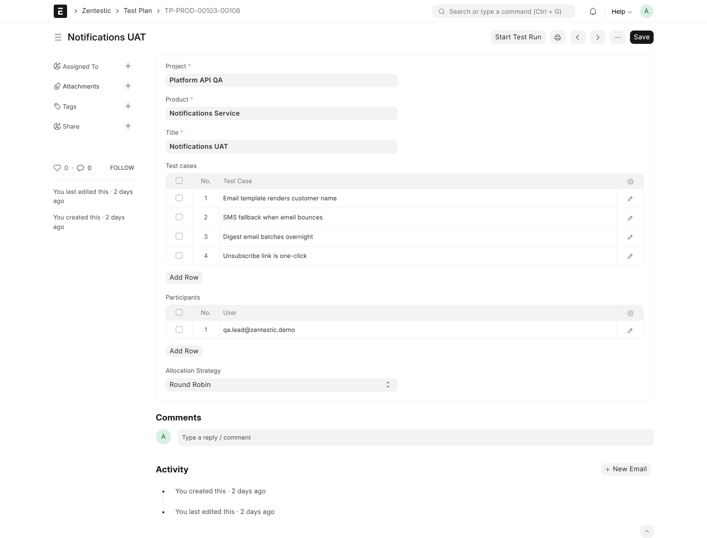
      
<strong>Test plan details</strong> Cases, testers, and round-robin or random assignment

    </td>
    <td align="center" valign="top" width="50%">
      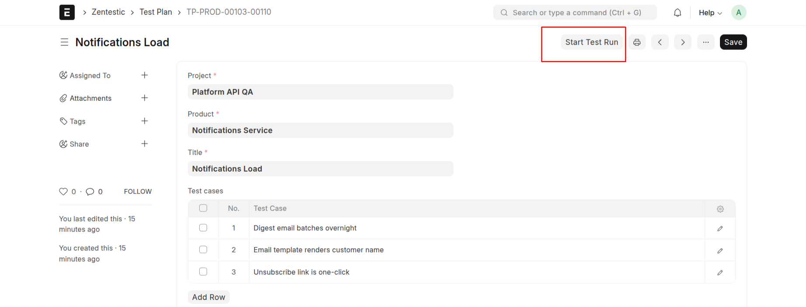
      
<strong>Start test run</strong> Launch a run directly from a plan

    </td>
  </tr>
  <tr>
    <td align="center" valign="top" width="50%">
      
      
<strong>Run from a plan</strong> Cases pre-assigned to testers with pending status

    </td>
    <td align="center" valign="top" width="50%"></td>
  </tr>
</table>

### Test runs

<table>
  <tr>
    <td align="center" valign="top" width="50%">
      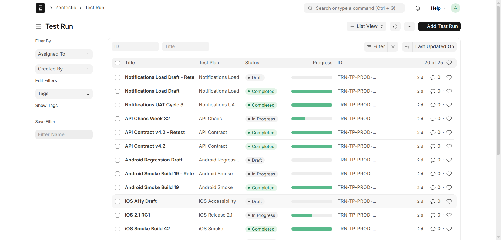
      
<strong>Test run list</strong> Status and progress across draft, in-progress, and completed runs

    </td>
    <td align="center" valign="top" width="50%">
      
      
<strong>New test run</strong> Set lead, status, results, and stakeholders

    </td>
  </tr>
  <tr>
    <td align="center" valign="top" width="50%">
      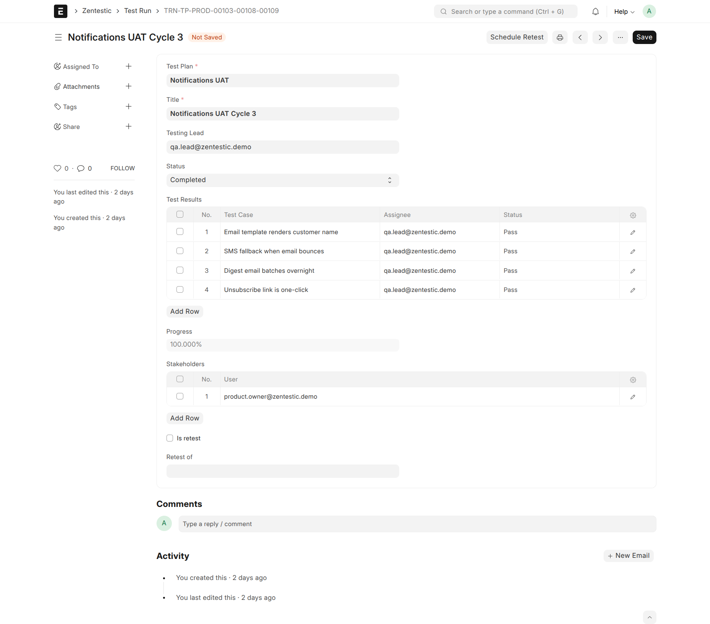
      
<strong>Test run details</strong> Results, stakeholders, and progress for a completed run

    </td>
    <td align="center" valign="top" width="50%">
      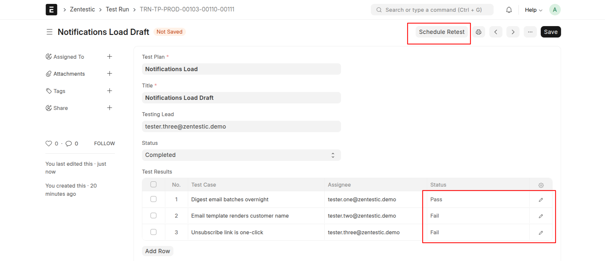
      
<strong>Results & retest</strong> Record Pass/Fail and schedule a retest for failures

    </td>
  </tr>
  <tr>
    <td align="center" valign="top" width="50%">
      
      
<strong>Retest run</strong> Failed and blocked cases carry forward automatically

    </td>
    <td align="center" valign="top" width="50%"></td>
  </tr>
</table>

## Getting Started

See [DEVNOTES.md](DEVNOTES.md) for installation instructions, demo data setup, and contribution guidelines.

## License

MIT
